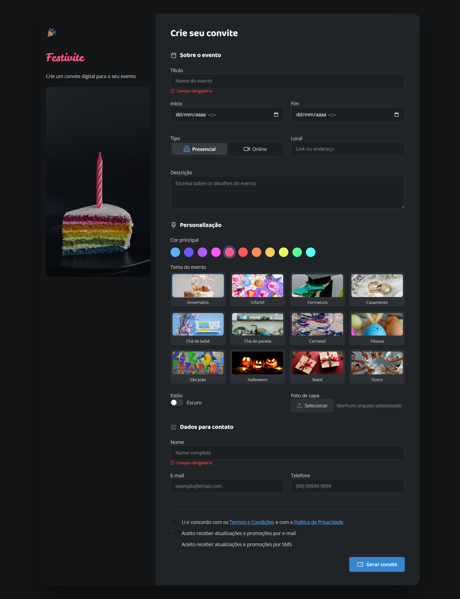

# Festivite

Formulário responsivo para criação e personalização de convites digitais.

## Prévia

<!-- Substitua o caminho abaixo pelo arquivo da imagem de apresentação do projeto. -->



## Projeto online

[Acesse o projeto](https://albericojr.github.io/Formulario_convite/)

## Funcionalidades

- Layout responsivo para desktop e dispositivos móveis.
- Formulário com dados do evento e informações de contato.
- Seleção de tipo de evento presencial ou online.
- Paleta de cores, temas e estilo visual personalizáveis.
- Upload de foto de capa.
- Campos obrigatórios e opções de consentimento.

## Tecnologias

- HTML5
- CSS3
- Google Fonts

## Como executar

1. Clone ou baixe este repositório.
2. Abra o arquivo `index.html` no navegador.

Também é possível usar a extensão Live Server do VS Code para abrir o projeto em um servidor local.

## Estrutura

```text
.
├── assets/
│   ├── icons/
│   └── imagens do projeto
├── style/
│   ├── aside.css
│   ├── global.css
│   ├── index.css
│   ├── main.css
│   └── personalizacao.css
├── index.html
└── README.md
```

## Status

Interface em desenvolvimento.

## Autor

**Alberico Jr.**

- GitHub: [Alberico Júnior](https://github.com/AlbericoJr/Formulario_convite)
